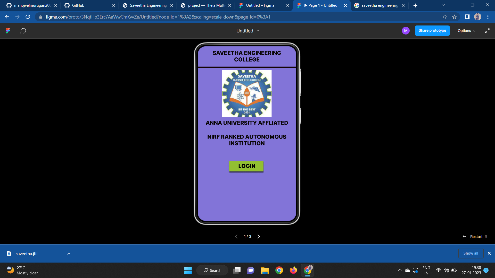
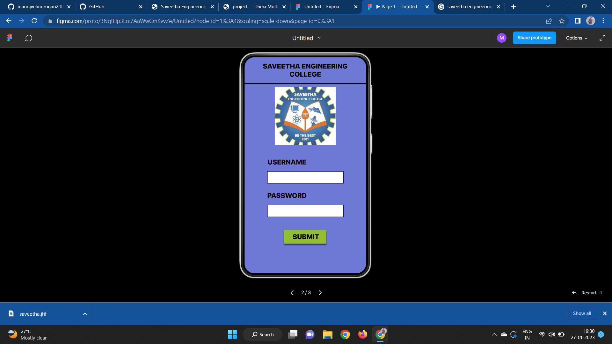
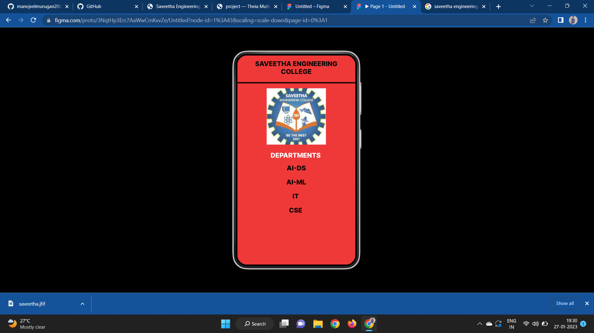

# Event Registration Web Application

## AIM:
To design, develop and deploy a web application for event registration.

## DESIGN STEPS:

### Step 1:
Create a new frame.

### Step 2:
Select any one preset size of your choice.

### Step 3:
Select the shapes you need.

### Step 4:
Import images as needed.

### Step 5:
Create pages based on your need and link them.

### Step 6:

Validate the HTML and CSS code.

### Step 6:

Publish the website in the given URL.

## DESIGN TOOL:
Figma

## code:
```
/* Home Page */
position: relative;
width: 360px;
height: 640px;
background: #8274D8;

/* login page */
position: relative;
width: 360px;
height: 640px;
background: #6E78D5;

/* SAVEETHA ENGINEERING COLLEGE */
position: absolute;
width: 339px;
height: 57px;
left: 10px;
top: 15px;
font-family: 'Inter';
font-style: normal;
font-weight: 800;
font-size: 20px;
line-height: 24px;
text-align: center;
color: #090505;

/* DEPARTMENTS */


position: absolute;
width: 153px;
height: 24px;
left: 101px;
top: 294px;
font-family: 'Inter';
font-style: normal;
font-weight: 800;
font-size: 20px;
line-height: 24px;
text-align: center;
color: #FFFFFF;

/* AI-DS */


position: absolute;
width: 339px;
height: 35px;
left: 10px;
top: 333px;
font-family: 'Inter';
font-style: normal;
font-weight: 800;
font-size: 20px;
line-height: 24px;
text-align: center;
color: #090505;

/* AI-ML */
position: absolute;
width: 339px;
height: 35px;
left: 10px;
top: 376px;
font-family: 'Inter';
font-style: normal;
font-weight: 800;
font-size: 20px;
line-height: 24px;
text-align: center;
color: #090505;

/* IT */
position: absolute;
width: 339px;
height: 35px;
left: 8px;
top: 419px;
font-family: 'Inter';
font-style: normal;
font-weight: 800;
font-size: 20px;
line-height: 24px;
text-align: center;
color: #090505;

/* CSE */
position: absolute;
width: 339px;
height: 35px;
left: 8px;
top: 462px;
font-family: 'Inter';
font-style: normal;
font-weight: 800;
font-size: 20px;
line-height: 24px;
text-align: center;
color: #090505;

/* Line 3 */
position: absolute;
width: 360px;
height: 0px;
left: 0px;
top: 86px;
border: 4px solid #140404;

/* saveetha 3 */
position: absolute;
width: 181px;
height: 172px;
left: 89px;
top: 101px;
background: url(saveetha.jpg);
```

## OUTPUT:





## RESULT:
The program to design, develop and deploy a web application for event registration is completed successfully.